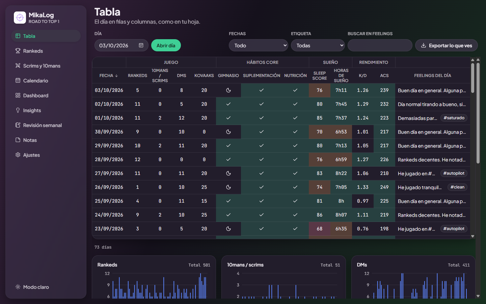

<p align="center">
  
</p>

# MikaLog

Diario de escritorio para jugadores de Valorant: apunta cada día tus partidas, tus hábitos, tu sueño y cómo te has sentido, y descubre con tus propios números qué te hace jugar mejor.

Es una app para Windows, gratuita y libre. Funciona sin cuenta y sin internet: todo lo que apuntas se queda en una carpeta de tu ordenador.



## Qué puedes hacer

- **Tabla**: una fila por día, como en una hoja de cálculo. Rankeds, scrims, DMs, Kovaaks, gimnasio, suplementación, nutrición, sueño, K/D y ACS, con colores según tus umbrales y una gráfica por columna.
- **Página del día**: los campos del día y un editor para escribir tus feelings, con `#etiquetas` como `#tilt` o `#saturado`.
- **Rankeds** y **Scrims y 10mans**: cada partida con su mapa, agente y resultado, y tus cifras por mapa y por agente.
- **Calendario**: mapa de calor mensual de la métrica que elijas.
- **Dashboard**: tendencias, rachas de hábitos y comparación con el periodo anterior.
- **Insights**: tu rendimiento con y sin cada hábito, por tramos de sueño y por etiqueta, con avisos de saturación y una puntuación de preparación del día.
- **Revisión semanal**: el resumen de la semana y tus tres conclusiones.
- **Notas**: VODs, lineups, rivales y objetivos, enlazadas entre sí y con los días mediante `[[ ]]`.
- **A tu medida**: añade, renombra o archiva campos y cambia sus umbrales. Modo claro y oscuro.

## Instalar

1. Descarga `MikaLog_x.y.z_x64-setup.exe` de la [última versión](https://github.com/MiguelAngelDiazTIC/Player-Tracker-App/releases/latest).
2. Ábrelo. El instalador no está firmado, así que Windows SmartScreen avisa la primera vez («Windows protegió su PC»): pulsa **Más información** y luego **Ejecutar de todas formas**.
3. No pide permisos de administrador: se instala solo para tu usuario, con acceso en el menú Inicio.
4. Al abrir la app por primera vez eliges la carpeta de datos (por defecto `Documentos\MikaLog`) y un tutorial te enseña cómo empezar.

Para **actualizar**, instala la versión nueva encima: tus datos se conservan. **Desinstalar** tampoco los borra, porque la carpeta de datos está fuera de la carpeta de la app.

Requisitos: Windows 10 u 11 de 64 bits.

## Empezar

El tutorial del primer arranque te ofrece tres caminos, y puedes repetirlo desde Ajustes > «Ver el tutorial»:

- **Importar tu hoja**: si ya te registrabas en Excel o Google Sheets, Ajustes > «Importar mi hoja» lee el `.xlsx` o el `.csv`, te deja emparejar las columnas y enseña una vista previa antes de guardar.
- **Cargar una copia**: un JSON exportado desde MikaLog en otro ordenador.
- **Empezar de cero**: crea el día de hoy y lo abre para que lo rellenes.

## Tus datos

- **Dónde están**: en la carpeta de datos que elegiste (`tracker.db` y las imágenes de tus notas). Puedes cambiarla en Ajustes, copiarla o sincronizarla con Drive por tu cuenta.
- **Copias automáticas**: al abrir la app, si la última copia tiene una semana o más, se guarda una copia completa en la carpeta `copias` y se conservan las 8 más recientes. La frecuencia se cambia en Ajustes.
- **Exportar**: a Excel (una pestaña por registro) o CSV desde Ajustes, y «Exportar lo que ves» en la Tabla, Rankeds y Scrims para llevarte solo las filas filtradas. La hoja de días sale con un formato que la app puede volver a importar.
- **Cambiar de ordenador**: Ajustes > «Exportar JSON» en el antiguo e «Importar JSON» en el nuevo.
- **Privacidad**: MikaLog no recoge ni envía ningún dato y no se conecta a internet.

## Licencia y avisos

Copyright (C) 2026 Miguel Ángel Díaz Gutiérrez (MikaEl).

- **Licencia**: software libre bajo la [GPL-3.0 o posterior](LICENSE). Puedes usarlo, estudiarlo, modificarlo y compartirlo; si repartes una versión modificada, debe tener la misma licencia. Sin garantía de ningún tipo.
- **Créditos**: toda copia o versión modificada debe conservar en su pantalla «Acerca de» la atribución al autor original y el enlace a este repositorio. El nombre «MikaLog» y su logo no entran en la licencia. Los detalles están en [NOTICE.md](NOTICE.md).
- **Riot Games**: MikaLog no está avalado por Riot Games ni refleja sus opiniones. Valorant y Riot Games son marcas de Riot Games, Inc.
- **Software de terceros**: sus licencias están en [THIRD-PARTY-NOTICES.md](THIRD-PARTY-NOTICES.md).
- **Contacto**: miguelangeldiaztic@gmail.com o las [incidencias](https://github.com/MiguelAngelDiazTIC/Player-Tracker-App/issues) de GitHub, para avisar de un fallo o proponer una mejora.

Dentro de la app, todo esto está en Ajustes > «Acerca de MikaLog».

## Desarrollo

Hecha con Tauri 2, React, TypeScript, Vite, Tailwind CSS y SQLite. En Windows hacen falta Node 24, Rust (rustup) y las Build Tools de C++ de Visual Studio.

```powershell
npm install
npm run tauri dev
```

| Comando               | Qué hace                                                        |
| --------------------- | --------------------------------------------------------------- |
| `npm run tauri dev`   | Abre la app en modo desarrollo                                  |
| `npm run tauri build` | Genera el instalador en `src-tauri/target/release/bundle/nsis/` |
| `npm run lint`        | ESLint                                                          |
| `npm run format`      | Formatea con Prettier (`format:check` solo comprueba)           |
| `npm run typecheck`   | Comprueba los tipos con TypeScript                              |
| `npm test`            | Pruebas con Vitest (`test:watch` las deja en marcha)            |
| `npm run notices`     | Regenera `THIRD-PARTY-NOTICES.md`                               |

### Ediciones

Del mismo código salen dos instaladores. La edición se elige al compilar con `VITE_EDITION` y está descrita en `src/app/edition.ts`.

| Edición                       | Comandos                                             | Qué cambia                                                                                    |
| ----------------------------- | ---------------------------------------------------- | --------------------------------------------------------------------------------------------- |
| MikaLog (`base`)              | `npm run tauri dev`, `npm run tauri build`           | La de siempre                                                                                 |
| MikaLog Saiz Edition (`saiz`) | `npm run tauri:dev:saiz`, `npm run tauri:build:saiz` | Sin el registro de scrims y 10mans: su columna de la Tabla es un número que se escribe a mano |

Cada una tiene su identificador (`com.playertracker.desktop` y `com.playertracker.saiz`), así que se instalan a la vez sin compartir configuración ni carpeta de datos. Las copias en JSON de una se abren en la otra. Las pruebas cubren las dos con el mismo `npm test`.

Documentación del proyecto:

- [La idea](docs/IDEA.md): el concepto original y sus vistas.
- [El plan](docs/PLAN.md): tecnologías, modelo de datos, fases y cómo quedó hecha cada una.
- [El diseño](docs/DESIGN.md): tokens, componentes y reglas de accesibilidad.

### Cómo está organizado

| Carpeta                          | Qué contiene                                                                 |
| -------------------------------- | ---------------------------------------------------------------------------- |
| `src/domain/`                    | Lógica pura con pruebas: campos, fechas, estadísticas, importar y exportar   |
| `src/data/`                      | SQLite, migraciones, repositorio y copias                                    |
| `src/app/`                       | Estado de la app y la interfaz `Platform`, que aísla lo que depende de Tauri |
| `src/platform/`                  | `Platform` con Tauri y el arranque (carpeta de datos)                        |
| `src/views/` y `src/components/` | Pantallas y componentes                                                      |
| `src/test/`                      | SQLite en memoria y servicios de prueba para probar la app entera            |
| `src-tauri/`                     | Lado nativo, iconos, permisos e instalador                                   |

### Publicar una versión

1. Sube el número en `package.json` (el instalador lo lee de ahí) y en `src-tauri/Cargo.toml`.
2. Crea y sube una etiqueta con ese número: `git tag v1.0.0` y `git push origin v1.0.0`.
3. El workflow «Publicar versión» pasa las pruebas, compila los instaladores de las dos ediciones y crea la Release con los `.exe` y las notas de `.github/release-notes.md`.

Al añadir, quitar o actualizar una dependencia, lanza `npm run notices` y sube el `THIRD-PARTY-NOTICES.md` que genera. El CI falla si no está al día o si entra una licencia incompatible con la GPL-3.0.

El logo maestro es `src-tauri/icons/logo.svg`. Si cambia, regenera los iconos con `npx tauri icon src-tauri/icons/logo.svg` y las imágenes del instalador con `pwsh scripts/installer-images.ps1`.

### Datos de ejemplo

Para ver la app llena sin tocar datos reales:

```powershell
npm run demo:data
npm run demo
```

`demo:data` genera `.demo/player-tracker-demo.json` con unas 11 semanas de datos inventados que acaban hoy. `demo` abre la app con una identidad aparte (`com.playertracker.demo`), así que su carpeta de datos no se mezcla con la de la app normal. La primera vez, elige una carpeta (por ejemplo `.demo/datos`) y carga el archivo desde Ajustes > Importar JSON.
